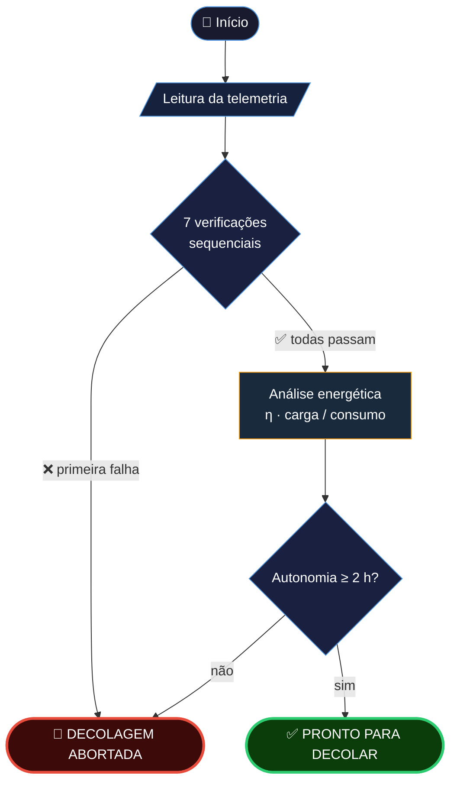
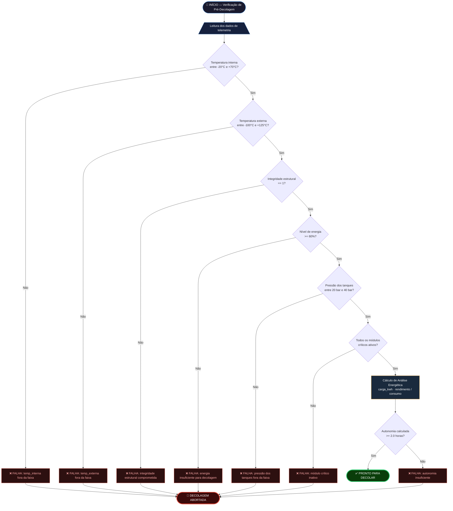

# ☄️ Aurora Siger — Relatório de Pré-Decolagem

[](https://colab.research.google.com/github/juliaramosguedes/fiap-fase-1-aurora-siger/blob/main/aurora_siger_report.ipynb)    [](https://github.com/juliaramosguedes/fiap-fase-1-aurora-siger/actions/workflows/notebook.yml) 


*Atividade Integradora · Fase 1 · Ciência da Computação, 2026 — FIAP*

🧑‍🚀 [Julia Ramos](https://www.linkedin.com/in/juliaramosguedes) · [Carlos Eugenio](https://www.linkedin.com/in/carloseugenioandrade/) · [Matheus Fuchelberguer](https://www.linkedin.com/in/matheus-fuchelberguer-neves/) · Julio Guma

---

   


Sistema de verificação de pré-decolagem de uma nave espacial interplanetária. Recebe dados de telemetria e emite uma decisão binária — **PRONTO PARA DECOLAR** ou **DECOLAGEM ABORTADA** — seguida de uma avaliação de risco por dois modelos de machine learning.

> [!CAUTION]
> *Porque **sem checklist, a gravidade toma a decisão** por você — e ela não consulta a tripulação.* 💥

---

## 🛰 Pipeline

```
Telemetria → Limiares de segurança → 7 verificações → Análise energética → Decisão → IA
```

1. **Telemetria** — lê temperaturas, integridade estrutural, nível de energia, pressão dos tanques e status dos 5 subsistemas críticos
2. **Limiares de segurança** — constantes nomeadas derivadas de dados NASA/ESA; única fonte de verdade do sistema, reutilizada tanto nas verificações quanto no treinamento da IA
3. **Verificações** — 7 funções puras retornando `bool`; estratégia fail-fast: a primeira falha aborta imediatamente
4. **Análise energética** — calcula carga atual, perdas resistivas (I²R), eficiência η e autonomia em horas
5. **IA** — IsolationForest + DecisionTree em paralelo; resultados comparados para consenso

> [!IMPORTANT]
> Resistência é inútil. Cada etapa em sequência — a primeira falha suspende a decolagem:



<details>
<summary>🔍 Fluxograma detalhado — verificação por parâmetro</summary>



</details>

---

## 🛸 Arquitetura

**Funções puras** — sem efeitos colaterais; mesmo input sempre produz mesmo output. Cada verificação é testável individualmente — mandatório em sistemas de segurança crítica.

**Imutabilidade** — `TelemetryReading` e `EnergyAnalysis` são snapshots no instante da verificação. `frozen=True` é um invariante de segurança: dados de telemetria não podem ser alterados após a leitura.

**Fonte única da verdade** — os limiares de segurança são definidos uma vez na Seção 2 e reutilizados tanto nas verificações quanto no treinamento da IA. Uma mudança propaga para o sistema inteiro.

**Estratégia fail-fast** — as 7 verificações rodam em sequência; a primeira falha aborta imediatamente. Padrão clássico de sistemas críticos. A lógica é inflexível.

**Redundância por consenso** — dois modelos independentes (supervisionado + não supervisionado) rodam em paralelo; o risco só é classificado como baixo quando há concordância. Reduz falsos negativos sem depender de um único ponto de falha.

---

## 👾 Modelos de IA

| Modelo | Tipo | Recall | Justificativa |
|---|---|---|---|
| IsolationForest | Não supervisionado | 94,8% | Detecta desvios do padrão nominal sem precisar de anomalias rotuladas — robusto quando eventos anômalos são raros |
| DecisionTreeClassifier | Supervisionado | 99,8% ± 0,4% (CV 5-fold) | Aprende regras if-then — mesma geometria do checklist; redescobre os limiares de segurança autonomamente |

Em sistemas de segurança crítica, **recall é a métrica prioritária**: uma anomalia não detectada é mais perigosa do que um abort desnecessário. Usar os dois modelos e comparar o consenso é mais confiável do que depender de um único.

O padrão de anomalia deste problema é uma disjunção de condições por feature — exatamente a geometria que a DecisionTree aprende. A árvore redescobre autonomamente os limiares codificados à mão (ex.: `energy_pct ≤ 62 → ANOMALIA`), funcionando como uma validação indireta do checklist de segurança.

---

## 📡 Resultado

**Telemetria e checklist completo:**

```
============================================================
🛰  TELEMETRIA DE PRÉ-DECOLAGEM - AURORA SIGER
    Sensores a postos. Leituras nominais recebidas.
============================================================
  Temperatura interna   :     22.5 °C
  Temperatura externa   :    -45.0 °C
  Integridade estrutural:        1   (1=OK, 0=FALHA)
  Nível de energia      :     87.3 %
  Pressão dos tanques   :     34.8 bar
  Propulsão             :       OK
  Gestão de energia     :       OK
  Comunicações          :       OK
  Controle térmico      :       OK
  Navegação / ADCS      :       OK
============================================================
============================================================
🔍 CHECKLIST DE PRÉ-DECOLAGEM
============================================================
  ✔︎  Temperatura interna            OK
  ✔︎  Temperatura externa            OK
  ✔︎  Integridade estrutural         OK
  ✔︎  Nível de energia               OK
  ✔︎  Pressão dos tanques            OK
  ✔︎  Módulos críticos               OK
  ✔︎  Autonomia                      OK
============================================================

  >>> PRONTO PARA DECOLAR <<<
  Pré-decolagem concluída. Tripulação, a seus postos. Vamos voar! 🚀

============================================================
```

**Avaliação de risco com base nos dois modelos de IA:**

```
============================================================
☄️  AVALIAÇÃO DE RISCO — AURORA SIGER
============================================================
  Classificação dos dados
    IsolationForest (não supervisionado) : NOMINAL
    DecisionTree    (supervisionado)   : NOMINAL
    Consenso entre modelos         : SIM

  Identificação de anomalia
    Probabilidade de anomalia     : 0.0%
    Recall IsolationForest        : 94.8%
    Recall DecisionTree (CV 5-fold): 99.8% ± 0.4%

  Avaliação de risco
    Nível de risco               : BAIXO
    Ação recomendada             : PROSSEGUIR COM CAUTELA

============================================================
  NOTA: A análise de IA é apenas suporte. A decisão final
  cabe ao operador humano. Sistemas automatizados não devem
  sobrepor o juízo humano em contextos de segurança crítica.
============================================================
```

**Relatório final de missão:**

```
============================================================
  ☄️  AURORA SIGER — RELATÓRIO FINAL DE MISSÃO
============================================================
  Energia disponível   : 96.38 kWh
  Autonomia            : 11.34 h
  IsolationForest      : NOMINAL
  DecisionTree         : NOMINAL
  Prob. de anomalia    : 0.0%

============================================================
  >>> PRONTO PARA DECOLAR <<<
  O universo espera. Boa viagem, Aurora Siger. Vida longa e próspera. 🖖
============================================================
```

> [!TIP]
> **Por que a DecisionTree atinge 100% de recall?** O padrão de anomalia é uma disjunção de condições por feature — a árvore aprende exatamente esse tipo de fronteira e redescobre os limiares codificados à mão (ex.: `energy_pct <= 62 → ANOMALIA`, `structural_integrity <= 0.5 → ANOMALIA`). É uma validação indireta do checklist.

---

## 🚀 Como executar

**Pré-requisitos:** Python 3.9+

Clone, instale e execute:

```bash
git clone https://github.com/juliaramosguides/fiap-fase-1-aurora-siger.git
cd fiap-fase-1-aurora-siger
pip install -r requirements.txt
jupyter notebook aurora_siger_report.ipynb
```

Na interface: **`Kernel → Restart & Run All`**

> [!TIP]
> **VS Code / Cursor:** abra o `.ipynb` com a extensão Jupyter e use **Run All**. A primeira célula verifica as dependências automaticamente.

## 🌌 Estrutura

```
fiap-fase-1-aurora-siger/
├── aurora_siger_report.ipynb   ← notebook principal
├── telemetry.md                ← limiares operacionais e fontes detalhadas
├── requirements.txt
└── README.md
```

---

## 🔭 Fontes

| Parâmetro | Fonte |
|---|---|
| Temperatura de eletrônicos | MIT OCW — *Satellite Engineering* (Keesee, 2003) |
| Temperatura de estrutura / painéis | ESA Bulletin 87 — *Spacecraft Thermal Control* |
| Integridade estrutural (flag 0/1) | ESA Mars Express — `right_flag` (Breskvar et al., 2022) |
| Energia mínima para decolagem (60%) | ESA Advanced Concepts Team (2021) |
| Pressão de tanques | NASA SBIR — *Spacecraft Thermal Management* |
| Módulos críticos | ESA ESOC — Mars Express subsystems |
| Padrão de anomalias para IA | NASA SMAP/MSL — Hundman et al., KDD 2018 |

> [!NOTE]
> Valores marcados como `# SIMULATED` no código foram estimados com base em ordens de grandeza documentadas.
> Consulte [`telemetry.md`](telemetry.md) para as justificativas completas.

---

## 🪐 Reflexão Crítica

### Ética e responsabilidade na tomada de decisão

O algoritmo decide, com base em dados, se uma decolagem deve ou não ocorrer — uma decisão que envolve vidas e recursos irreversíveis. A escolha de arquitetura não é apenas técnica: é uma resposta ética deliberada.

A ISO 26000 (ABNT, 2010) estabelece **accountability** como princípio central de responsabilidade social: quem responde pelas decisões tomadas com base em análise de IA? O projeto responde por design. As 7 funções de verificação são puras e auditáveis individualmente. O output da IA é explicitamente classificado como "ferramenta de suporte" — o operador humano tem a palavra final, e o sistema foi construído para que essa hierarquia seja inviolável. A escolha de priorizar recall sobre precision também é uma escolha de valores: uma anomalia não detectada é mais perigosa que um abort desnecessário.

Outra prática ética presente no código: valores sem dataset de origem são marcados com `# SIMULATED`. Declarar explicitamente o que se sabe e o que é estimativa — não apenas o resultado final — é a primeira responsabilidade do cientista de dados.

### Sustentabilidade tecnológica

Este projeto carrega uma contradição interna: a Seção 3 calcula eficiência energética (η, perdas I²R, autonomia em horas) enquanto a Seção 4 treina modelos de machine learning — que também consomem energia para operar. Não é apenas uma tensão abstrata: ela existe dentro do próprio notebook.

Em escala global, data centers já respondem por ~2% do consumo elétrico (The Green Grid, 2023), e esse percentual cresce com IA e big data. O PROCEL evitou 140 milhões de toneladas de CO₂ entre 1990 e 2022. O IPCC (2023) projeta que eficiência energética pode contribuir com 40% da redução de emissões até 2030. A computação que mede eficiência precisa também ser medida por ela.

### Impacto social da exploração espacial

A exploração espacial consome recursos energéticos e materiais intensivos — incluindo eletrônicos cujo ciclo de vida não termina no lançamento. O conceito de **Triple Bottom Line** (D'Hont, 2019) — People, Planet, Profit — obriga perguntar: quem se beneficia? A que custo planetário? Qual o retorno justificável?

O lixo eletrônico é um elo dessa cadeia frequentemente invisível. O Brasil gerou mais de 2 milhões de toneladas em 2019, reciclando menos de 3% (The Global E-Waste Monitor, 2020). Satélites e sistemas embarcados contribuem para esse fluxo através de componentes especializados, materiais raros e infraestrutura de suporte que raramente tem destino de reciclagem documentado.

### Consideração final

Toda simulação carrega uma tensão entre a precisão do modelo e a imprecisão das premissas. Aurora Siger atinge 99,8% de recall na classificação de anomalias — mas parte dos parâmetros de entrada são estimativas de ordem de grandeza. A precisão matemática não apaga a incerteza das premissas. Documentar essa incerteza honestamente não é uma limitação do projeto: é sua prática ética mais concreta. O universo é grande — as premissas, inevitavelmente menores.

Construir sistemas que tomam decisões críticas exige não apenas domínio técnico, mas consciência de que os dados têm origem, os modelos têm premissas, e as escolhas de design — recall sobre precision, auditabilidade sobre opacidade, transparência sobre resultado — são sempre escolhas de valores.

> [!IMPORTANT]
> *A lógica é o começo da sabedoria, não o fim.* 🖖
