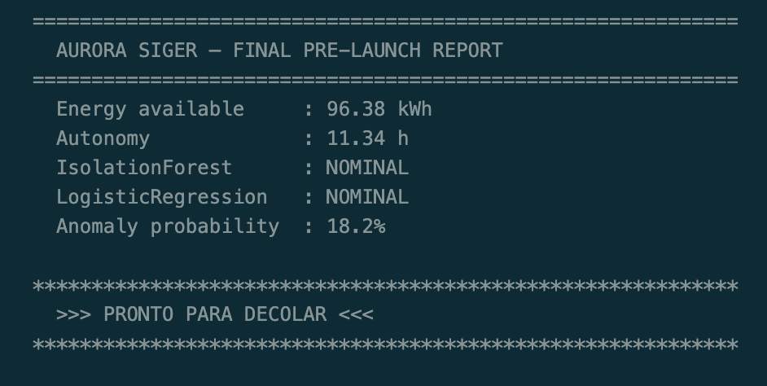

# 🚀 Missão Aurora Siger — Relatório Operacional de Pré-Decolagem

**Curso:** Ciência da Computação — FIAP  
**Fase:** 1 — Atividade Integradora  
**Participantes:** Julia Ramos · Carlos Eugenio · Julio Guma · Matheus Fuchens

---

## Sobre o projeto

Este repositório implementa o **Relatório Operacional de Pré-Decolagem** da missão fictícia **Aurora Siger**, uma simulação de missão espacial interplanetária proposta como atividade integradora da Fase 1 do curso.

O sistema lê dados de telemetria de uma nave, executa verificações de segurança, calcula autonomia energética, classifica anomalias com IA e emite o veredicto final:

```
PRONTO PARA DECOLAR   ou   DECOLAGEM ABORTADA
```

---

## Estrutura do repositório

```
aurora-siger/
├── aurora_siger.ipynb            ← notebook principal (execute aqui)
├── verification_flowchart.md     ← algoritmo de decisão em Mermaid
├── telemetry_reference.md       ← valores e faixas seguras com fontes
└── README.md
```

---

## Como executar

### Pré-requisitos

- Python 3.9 ou superior
- pip

Verifique sua versão:

```bash
python --version
pip --version
```

### Instalação

```bash
# 1. Clone o repositório
git clone https://github.com/<seu-usuario>/aurora-siger.git
cd aurora-siger

# 2. Instale as dependências
pip install notebook numpy pandas scikit-learn
```

### Executando o notebook

```bash
# 3. Abra o Jupyter
jupyter notebook aurora_siger.ipynb
```

Na interface que abrir no navegador:

- **Menu:** `Kernel → Restart & Run All`

A primeira célula de código verificará automaticamente se todas as dependências estão disponíveis e informará caso alguma esteja faltando.

### Alternativa — JupyterLab

```bash
pip install jupyterlab
jupyter lab aurora_siger.ipynb
```

### Alternativa — VS Code / Cursor

Abra `aurora_siger.ipynb` diretamente no VS Code ou Cursor com a extensão **Jupyter** instalada. Use o botão **Run All** no topo do arquivo.

---

## Resultado da execução



---

## Fontes dos dados de telemetria

Os valores e faixas seguras foram derivados de datasets e documentação reais:

| Parâmetro | Fonte |
|---|---|
| Temperatura operacional de eletrônicos | MIT OCW — *Satellite Engineering* (Keesee, 2003) |
| Temperatura de estrutura / painéis | ESA Bulletin 87 — *Spacecraft Thermal Control* |
| Integridade estrutural (flag 0/1) | ESA Mars Express dataset — `right_flag` (Breskvar et al., 2022) |
| Energia mínima para decolagem (60%) | ESA Advanced Concepts Team (2021) |
| Pressão de tanques | NASA SBIR — *Spacecraft Thermal Management* |
| Estrutura de módulos críticos | ESA ESOC — Mars Express subsystems |
| Padrão de anomalias para IA | NASA SMAP/MSL — Hundman et al., KDD 2018 |

Valores marcados como `# SIMULATED` no notebook foram criados com base em ordens de grandeza documentadas. Consulte `telemetry_reference.md` para detalhes completos.

---

## Seções do relatório

| # | Seção | O que implementa |
|---|---|---|
| 1 | Telemetria | Leitura e apresentação dos dados da nave |
| 2 | Algoritmo | Fluxograma de decisão em Mermaid |
| 3 | Script Python | Funções de verificação (functional programming) |
| 4 | Análise energética | Cálculo de autonomia com η, FC e P=I²R |
| 5 | Análise por IA | IsolationForest + LogisticRegression (scikit-learn) |
| 6 | Reflexão crítica | Ética, impacto social e sustentabilidade |

---

## Tecnologias


