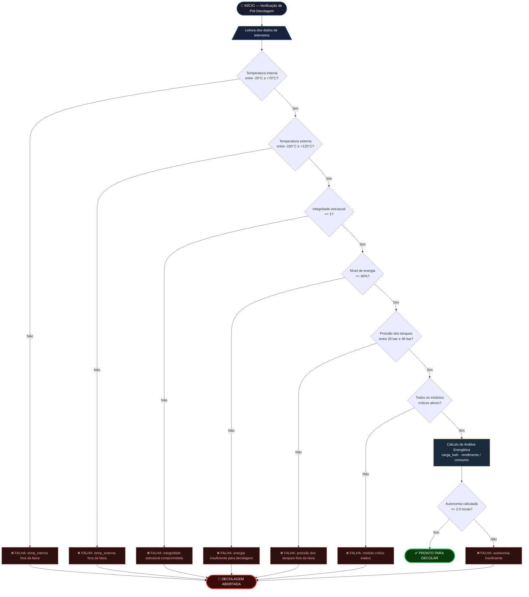

# Algoritmo de Verificação de Pré-Decolagem — Missão Aurora Siger

> Representação visual do algoritmo de decisão implementado no notebook Python.
> Renderiza nativamente no GitHub (Markdown com suporte a Mermaid).



---

## Descrição do fluxo

O algoritmo executa **7 verificações sequenciais** com estratégia **fail-fast**: ao
encontrar a primeira falha, interrompe imediatamente e emite `DECOLAGEM ABORTADA` — sem
continuar para as verificações seguintes. Somente se **todas** as 7 passarem, o sistema
emite `PRONTO PARA DECOLAR`.

> **Por que fail-fast?** Em sistemas de segurança crítica, continuar verificações após
> uma falha conhecida pode mascarar o estado real do sistema e atrasar a decisão de abort.
> A convergência visual dos nós `ABORT_Tx → ABORT_FINAL` no diagrama representa os
> diferentes pontos de saída possíveis — não execução paralela.

| # | Verificação | Faixa segura | Fonte dos limites |
|---|---|---|---|
| 1 | Temperatura interna | -20°C a +70°C | MIT OCW Satellite Engineering (2003) |
| 2 | Temperatura externa | -100°C a +125°C | MIT OCW / ESA Bulletin 87 |
| 3 | Integridade estrutural | == 1 (íntegra) | NASA SMAP/MSL — flag binário |
| 4 | Nível de energia | >= 60% | ESA Advanced Concepts Team (2021) |
| 5 | Pressão dos tanques | 20 a 40 bar | NASA SBIR Thermal Management |
| 6 | Módulos críticos | todos True | ESA Mars Express subsystems |
| 7 | Autonomia energética | >= 2.0 horas | Calculado com η=0.92, Cap. 7 FIAP |

---

## Arquitetura das funções Python

Cada verificação do fluxograma corresponde a uma função pura no notebook.
Todas retornam `bool` sem efeitos colaterais.

```
# Funções de verificação individuais — puras, sem efeitos colaterais
check_internal_temperature(value: float)          → bool
check_external_temperature(value: float)          → bool
check_structural_integrity(flag: int)             → bool
check_energy_level(pct: float)                    → bool
check_tank_pressure(bar: float)                   → bool
check_critical_modules(reading: TelemetryReading) → bool
check_autonomy(autonomy_hours: float)             → bool

# Análise energética
compute_energy_analysis(...)                      → EnergyAnalysis

# Consolidação — composição das funções acima
run_checks(reading, autonomy_hours)               → Dict[str, bool]
decide_launch(checks)                             → str
verify_launch_readiness(reading, autonomy_hours)  → Tuple[str, Dict[str, bool]]

# Seção 5 — análise por IA (modelos retornam dataclasses frozen)
train_isolation_forest(X, y, contamination)       → IsolationForestResult
classify_with_isolation_forest(result, reading)   → str
train_decision_tree(X, y, reading, ...)           → DecisionTreeResult
build_ai_risk_summary(iso_result, iso_recall, dt) → str
```

`verify_launch_readiness` é a composição de `run_checks` + `decide_launch`. Retorna
`(decision, checks)` onde `decision` é `"PRONTO PARA DECOLAR"` ou `"DECOLAGEM ABORTADA"`
e `checks` é o mapa individual de cada verificação — útil para auditoria e logging.

## Conexão entre o fluxograma e a DecisionTree (Seção 5)

O fluxograma define regras explícitas: `se temp_interna fora do limite → ABORTAR`.
A `DecisionTreeClassifier` aprende essas mesmas regras **de forma autônoma**, sem
receber os limiares diretamente. Os thresholds que ela descobre a partir dos dados
convergem para os valores codificados na Seção 3 — validando experimentalmente que
os limiares de segurança são discriminantes suficientes para classificar anomalias.